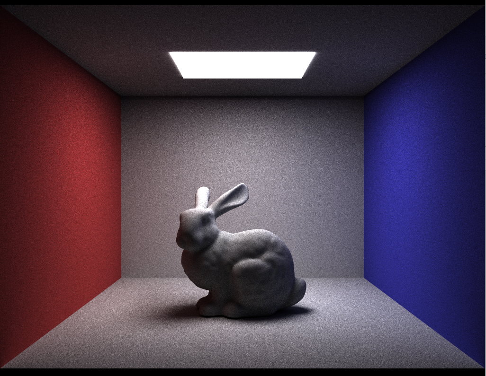

# CUDA Path Tracer

Path tracing has long been the select method used by the graphics community to render photo-realistic images. It has found wide uses across several industries, and plays a major role in animation and filmmaking, with most special effects rendered using some form of Monte Carlo light transport. 

It comes as no surprise, then, that optimizing path tracing algorithms is a widely studied field, so much so, that it has it’s own top-tier conference (HPG; High Performance Graphics). One specific class of methods focuses on altering existing algorithms to better utilize system resource.
Most of these methods, understandably, focus on the ray-scene intersection part of the path tracing pipeline, since that is the main bottleneck. In the following project, we describe the implementation of a hybrid non-packet method which uses Wide Trees and Dynamic Ray Scheduling to provide an 80x improvement over a 8-threaded CPU implementation.

Our algorithm is based on breadth-first traversal of the BVH tree. We find that this achieves much better SIMD utilization since there is no need to work with packets of potentially diverging rays.

Our algorithm has two major features:
 - Rays are processed in blocks. Each block processes a fixed subset of the BVH.
 - Rays are arranged using exclusive scan and a push operation so that the rays are in order of their BVH intersection index.
 
 
 Once the intersections are found, there are potentially multiple intersections for each ray because of the highly asynchronous method in which occlusions are handled.
 The closest intersection is computed using a fairly simple parallel min operation
  
 
 The process is repeated for each bounce. 
 
 Once the image is constructed, it is filtered to remove as much noise as possible. For the scope of this project, we use a simple median filter, but we could optionally use a more complex filtering method in the future.
 

Some classic examples of the images produces by this method.

Our performance improvements over a multi-core CPU implementation (Scotty3D, CMU's educational renderer)

To explain how we picked our hyperparamters (BVH tree width, block size, and rays per block), we show some performance graphs while varying the hyperparameters

Our implementation is also roughly 10 times faster than mitsuba, which is a popular physically-based renderer using in research. 

The full report can be found here:
[Technical Report](path-tracer.pdf)
